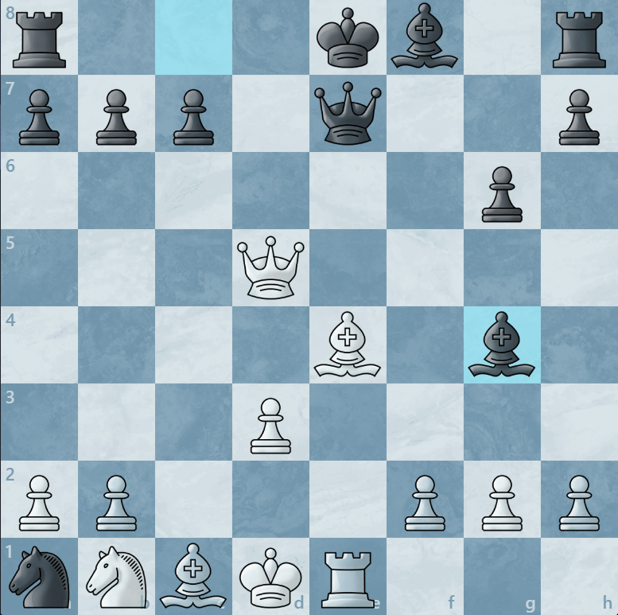

# Chess Commentary LLM
[View on GitHub](https://github.com/umldataclub/Chess-Language-Model){ .md-button .md-button--primary }

## Vision

This project explores training language models to produce chess commentary. While existing models have some ability to discuss chess, this project uniquely approaches the problem by improving the model's native ability for chess understanding, rather than relying on zero-shot, hallucination-prone generation.

This project lies on two key insights:

1. With an architectural approach, we can improve the model's capacity to understand chess positions by representing the position with regard to it's key properties, instead of as raw text. Similar to how multimodal LLMs can learn visual understanding with CNN-based image adapters, we can create an informative representation of the position and train an adapter to project it into the embedding space of the LM. 

2. By extracting informative features (pins, forks, control, continuations, etc.) we can prompt LLMs to generate commentary as training data, with precise control over the content and style of our training dataset. This enables a consistent and predictable training signal and avoids the need for noisy and sparse human-written commentary that requires significant collection efforts.

## Current Best Iteration

Currently, the best model uses a straightforward representation of the position (see [architecture](#architecture) section), projected into the LM context by a shallow NN. 


Below are some generations by the current best trained model.


<details markdown="1">
<summary><strong>Example 1: Tactical Middle Game (Click to Expand)</strong></summary>

### Position


### Chess LM Generation

"White enjoys a slight advantage due to better central control and a more active knight on d5. Black's queen on g6 is active but also potentially vulnerable. White's pawn on b5 is advanced, and the knight on d5 is well-placed. Black's pawn structure is slightly compromised with an isolated pawn on d6. The engine suggests White can maintain this advantage with moves like Qxd5, which maintains White's initiative."


</details>


<details markdown="1">
<summary><strong>Example 2: Forced Mate Attack (Click to Expand)</strong></summary>

### Position


### Chess LM Generation

"White has a significant material advantage and a strong attacking position. The queen on g6 is very active, eyeing Black's kingside 
pawns and the d4 pawn. White's rook on h3 is also well-placed, supporting the attack. Black's queen on b6 is somewhat passive, but 
the pawn on c4 is a potential weakness. White's advantage is overwhelming, and Black's only hope is to consolidate and defend their 
position."


</details>


### Notes
The model demonstrates quite impressive surface level understanding. It can be described as having strong 'first glance understanding,' where it can accurately evaluate and describe key features of the position especially when one side is dominant. Broadly, it often references specific pieces correctly and may accurately elude to their significance in the position (activity, control, vulnerability, etc.). However, it lacks analytical depth and often makes innacurate proclamations about fine details, moves/pieces, or about significant positional aspects when it's not as clear. 

### Limitations and Future Work
As a first iteration, this model proved to be a solid foundation for future work. The training dataset consists of ~27,000 position-commentary pairs. The model was trained for 10-15 epochs before overfitting. A larger dataset would likely be beneficial. Additionally, the quality of the Gemini-generated commentary is variable and the prompt used to generate it could be improved (namely the tactic detection could be made more precise and less redundant) to produce more accurate or different styles of commentary.

While simple understanding is there, the architecture may be a limiting factor to deeper understanding. The current adapter uses a small MLP to project a simple set of per-square features into the LM's embedding space. A sophisticated approach could utilize more powerful position encoders, like a pre-trained chess transformer, to better capture the complex relationships between pieces on the board and encode them for the LM. 

---

## Dataset Curation & Processing

The power of this model comes from its synthetic training data. Instead of training on raw PGNs or scarce human commentary, it uses a **Rich Augmented Generation** pipeline to synthesize well-informed analysis.


### 1. Context Engineering
The `CommentaryGenerator` (`src/data_collection/generator.py`) builds a prompt for every position. It provides the ground truth necessary for accurate reasoning:

- **Engine Truth**: Stockfish complete Principal Variations (PVs) determine the objective status of the game.
- **Human Modeling**: Uses **Maia Chess** (a distinct neural network) to predict what humans at different ELO ratings (1100, 1500, 1900) would play. In cases where computer moves aren't very interpretable, human moves can portray explainable aspects of the position.
- **Tactical Detector**: A custom analysis module explicitly identifies pins, forks, skewers, and discovered attacks in the current position and in future stockfish/maia variations, explicitly highlighting imminent or likely tactics in the position.
- **Semantic Features**: Calculates material imbalances, pawn structures (isolated/doubled), king safety, and center control metrics.


### Example Training Pair

<details markdown="1">
<summary><strong>Image and Generation</strong></summary>

<!-- TODO: Add chess position image -->


**Generated Commentary:**


"This is a volatile and highly tactical middlegame where both kings are dangerously exposed in the center. White's pieces are aggressively posted, particularly the Queen on d5 and the Bishop on e4, which exert tremendous pressure. Despite what the material balance suggests (Black seems to have an extra piece or exchange), White's attack against the uncastled Black king is the overriding concern. Black's primary asset is the annoying bishop on g4, which keeps the White king pinned down on d1. White needs an immediate, decisive tactical breakthrough, likely involving Bf3 or f3, to resolve the pin and exploit the exposed Black monarch before Black can consolidate the material advantage or bring the trapped knight on a1 into play."


</details>

<details markdown="1">
<summary><strong>Prompt</strong></summary>

**Prompt**
```text
GENERATE CHESS POSITION COMMENTARY

POSITION CONTEXT:
[FEN]: r3kb1r/ppp1q2p/6p1/3Q4/4B1b1/3P4/PP3PPP/nNBKR3 w - - 2 15
[Side to Move]: White
[Move Number]: 15

CURRENT POSITION TACTICS:
  - PIN: White queen on d5 pins Black pawn on b7 to Black rook on a8


DETAILED SEMANTIC DATA:
[Material Balance]: -4 (Positive = White advantage)
[Center Control]: White controls 4 squares, Black controls 2 squares.
[Pawn Structure]:
  - White: {'count': 6, 'doubled': 0, 'isolated': 1}
  - Black: {'count': 5, 'doubled': 0, 'isolated': 0}
[King Safety]:
  - White: Shield: 0 pawns, Castled: False
  - Black: Shield: 0 pawns, Castled: False


BOARD TENSIONS:
[White Attacks]:
  - White bishop on e4 attacks Black's pawn on g6
  - White queen on d5 attacks Black's pawn on b7

[Black Attacks]:
  - Black bishop on g4 attacks White's king on d1
  - Black queen on e7 attacks White's bishop on e4

[White Defends]:
  - White rook on e1 defends king on d1
  - White rook on e1 defends bishop on e4
  - White pawn on d3 defends bishop on e4
  - White queen on d5 defends bishop on e4

[Black Defends]:
  - Black pawn on h7 defends pawn on g6

ENGINE ANALYSIS (top 3 continuations from this position):
  1. Bf3 [Eval: +3.73]
     Line: 15. Bf3 Rd8 16. Rxe7+ Bxe7 17. Qxb7 Rxd3+ 18. Bd2 Bxf3+
     → PIN after Bf3: White rook on e1 pins Black queen on e7 to Black king on e8
     → PIN after Bf3: Black bishop on g4 pins White bishop on f3 to White king on d1
     → DISCOVERED_ATTACK after Bf3: White rook on e1 attacks Black queen on e7 (revealed)
     → SKEWER after Rd8: Black rook on d8 skewers White queen on d5, exposing White pawn on d3
     → PIN after Rxe7+: White rook on e7 pins Black pawn on c7 to Black pawn on b7
     → PIN after Qxb7: Black rook on d8 pins White pawn on d3 to White king on d1
     → FORK after Rxd3+: Black rook on d3 forks White king on d1, White bishop on f3
  2. f3 [Eval: +1.31]
     Line: 15. f3 Rd8 16. Qb5+ c6 17. Bxc6+ bxc6 18. Rxe7+ Bxe7
     → PIN after f3: Black bishop on g4 pins White pawn on f3 to White king on d1
     → PIN after Qb5+: Black rook on d8 pins White pawn on d3 to White king on d1
     → DISCOVERED_ATTACK after Qb5+: White bishop on e4 attacks Black pawn on b7 (revealed)
     → PIN after c6: White queen on b5 pins Black pawn on c6 to Black king on e8
     → PIN after Bxc6+: White rook on e1 pins Black queen on e7 to Black king on e8
     → BATTERY_ATTACK after Bxc6+: Moving White bishop on c6 discovers attack by White queen on Black king (e8)
     → DISCOVERED_ATTACK after Bxc6+: White rook on e1 attacks Black queen on e7 (revealed)
     → PIN after bxc6: White queen on b5 pins Black pawn on c6 to Black king on e8
  3. Re2 [Eval: -2.31]
     Line: 15. Re2 Bxe2+ 16. Kxe2 Nc2 17. Qxb7 Nd4+ 18. Kf1 Rd8
     → PIN after Re2: Black bishop on g4 pins White rook on e2 to White king on d1
     → PIN after Kxe2: Black queen on e7 pins White bishop on e4 to White king on e2
     → BATTERY_ATTACK after Nc2: Moving White pawn on d3 discovers attack by White bishop on Black knight (c2)
     → BATTERY_ATTACK after Qxb7: Moving White queen on b7 discovers attack by White bishop on Black rook (a8)
     → BATTERY_ATTACK after Qxb7: Moving Black pawn on c7 discovers attack by Black queen on White queen (b7)


HUMANLIKE LINES (typical moves by players at different skill levels):
  [1100 ELO player moves]:
    f3 (69% likely): 15. f3 Rd8 16. Qb5+ c6 17. Bxc6+ bxc6 18. Rxe7+ Bxe7
      -> PIN after f3: Black bishop on g4 pins White pawn on f3 to White king on d1
      -> PIN after Qb5+: Black rook on d8 pins White pawn on d3 to White king on d1
      -> DISCOVERED_ATTACK after Qb5+: White bishop on e4 attacks Black pawn on b7 (revealed)
      -> PIN after c6: White queen on b5 pins Black pawn on c6 to Black king on e8
      -> PIN after Bxc6+: White rook on e1 pins Black queen on e7 to Black king on e8
      -> BATTERY_ATTACK after Bxc6+: Moving White bishop on c6 discovers attack by White queen on Black king (e8)
      -> DISCOVERED_ATTACK after Bxc6+: White rook on e1 attacks Black queen on e7 (revealed)
      -> PIN after bxc6: White queen on b5 pins Black pawn on c6 to Black king on e8
    Bf3 (26% likely): 15. Bf3 Rd8 16. Rxe7+ Bxe7 17. Qxb7 Rxd3+ 18. Bd2 Bxf3+
      -> PIN after Bf3: White rook on e1 pins Black queen on e7 to Black king on e8
      -> PIN after Bf3: Black bishop on g4 pins White bishop on f3 to White king on d1
      -> DISCOVERED_ATTACK after Bf3: White rook on e1 attacks Black queen on e7 (revealed)
      -> SKEWER after Rd8: Black rook on d8 skewers White queen on d5, exposing White pawn on d3
      -> PIN after Rxe7+: White rook on e7 pins Black pawn on c7 to Black pawn on b7
      -> PIN after Qxb7: Black rook on d8 pins White pawn on d3 to White king on d1
      -> FORK after Rxd3+: Black rook on d3 forks White king on d1, White bishop on f3
    Kd2 (5% likely): 15. Kd2 Qb4+ 16. Nc3 Bh6+ 17. Re3 Bxe3+ 18. fxe3
      -> FORK after Qb4+: Black queen on b4 forks White king on d2, White bishop on e4
      -> PIN after Qb4+: Black queen on b4 pins White pawn on b2 to White knight on b1
      -> SKEWER after Qb4+: Black queen on b4 skewers White king on d2, exposing White rook on e1
      -> BATTERY_ATTACK after Qb4+: Moving White bishop on e4 discovers attack by White rook on Black king (e8)
      -> PIN after Nc3: Black queen on b4 pins White knight on c3 to White king on d2
      -> BATTERY_ATTACK after Nc3: Moving White bishop on c1 discovers attack by White rook on Black knight (a1)
      -> BATTERY_ATTACK after Bh6+: Moving White king on d2 discovers attack by White bishop on Black bishop (h6)
      -> PIN after Re3: Black bishop on h6 pins White rook on e3 to White king on d2
      -> SKEWER after Bxe3+: Black bishop on e3 skewers White king on d2, exposing White bishop on c1
      -> BATTERY_ATTACK after Bxe3+: Moving White king on d2 discovers attack by White bishop on Black bishop (e3)

  [1500 ELO player moves]:
    f3 (67% likely): 15. f3 Rd8 16. Qb5+ c6 17. Bxc6+ bxc6 18. Rxe7+ Bxe7
      -> PIN after f3: Black bishop on g4 pins White pawn on f3 to White king on d1
      -> PIN after Qb5+: Black rook on d8 pins White pawn on d3 to White king on d1
      -> DISCOVERED_ATTACK after Qb5+: White bishop on e4 attacks Black pawn on b7 (revealed)
      -> PIN after c6: White queen on b5 pins Black pawn on c6 to Black king on e8
      -> PIN after Bxc6+: White rook on e1 pins Black queen on e7 to Black king on e8
      -> BATTERY_ATTACK after Bxc6+: Moving White bishop on c6 discovers attack by White queen on Black king (e8)
      -> DISCOVERED_ATTACK after Bxc6+: White rook on e1 attacks Black queen on e7 (revealed)
      -> PIN after bxc6: White queen on b5 pins Black pawn on c6 to Black king on e8
    Bf3 (29% likely): 15. Bf3 Rd8 16. Rxe7+ Bxe7 17. Qxb7 Rxd3+ 18. Bd2 Bxf3+
      -> PIN after Bf3: White rook on e1 pins Black queen on e7 to Black king on e8
      -> PIN after Bf3: Black bishop on g4 pins White bishop on f3 to White king on d1
      -> DISCOVERED_ATTACK after Bf3: White rook on e1 attacks Black queen on e7 (revealed)
      -> SKEWER after Rd8: Black rook on d8 skewers White queen on d5, exposing White pawn on d3
      -> PIN after Rxe7+: White rook on e7 pins Black pawn on c7 to Black pawn on b7
      -> PIN after Qxb7: Black rook on d8 pins White pawn on d3 to White king on d1
      -> FORK after Rxd3+: Black rook on d8 forks White king on d1, White bishop on f3

  [1900 ELO player moves]:
    f3 (72% likely): 15. f3 Rd8 16. Qb5+ c6 17. Bxc6+ bxc6 18. Rxe7+ Bxe7
      -> PIN after f3: Black bishop on g4 pins White pawn on f3 to White king on d1
      -> PIN after Qb5+: Black rook on d8 pins White pawn on d3 to White king on d1
      -> DISCOVERED_ATTACK after Qb5+: White bishop on e4 attacks Black pawn on b7 (revealed)
      -> PIN after c6: White queen on b5 pins Black pawn on c6 to Black king on e8
      -> PIN after Bxc6+: White rook on e1 pins Black queen on e7 to Black king on e8
      -> BATTERY_ATTACK after Bxc6+: Moving White bishop on c6 discovers attack by White queen on Black king (e8)
      -> DISCOVERED_ATTACK after Bxc6+: White rook on e1 attacks Black queen on e7 (revealed)
      -> PIN after bxc6: White queen on b5 pins Black pawn on c6 to Black king on e8
    Bf3 (26% likely): 15. Bf3 Rd8 16. Rxe7+ Bxe7 17. Qxb7 Rxd3+ 18. Bd2 Bxf3+
      -> PIN after Bf3: White rook on e1 pins Black queen on e7 to Black king on e8
      -> PIN after Bf3: Black bishop on g4 pins White bishop on f3 to White king on d1
      -> DISCOVERED_ATTACK after Bf3: White rook on e1 attacks Black queen on e7 (revealed)
      -> SKEWER after Rd8: Black rook on d8 skewers White queen on d5, exposing White pawn on d3
      -> PIN after Rxe7+: White rook on e7 pins Black pawn on c7 to Black pawn on b7
      -> PIN after Qxb7: Black rook on d8 pins White pawn on d3 to White king on d1
      -> FORK after Rxd3+: Black rook on d3 forks White king on d1, White bishop on f3


TASK:
Generate chess position commentary:
1. Commentary: Overall positional assessment - key factors, imbalances, and evaluation

GUIDELINES:
- Your purpose is to generate intuitive descriptions of chess positions as curation of a chess-language model training dataset
- The context given should be used to deduce information about the position. Avoid baseless inferences and elaborations. 
- You should give humanlike commentary. Depending on your ability to produce commentary on the particular position, it may reflect observations of a player at any skill level. But should have a subjective feel, and should not directly reference or imply access to any of these artifacts or engine evaluations. 
- The "Humanlike Tactical Lines" section shows moves that typical players might play and the resulting tactical threats (forks, pins, discovered attacks). Use this along with the engine analysis to understand the most impactful tactics in the position that are likely to occur.
- Focus on intuitive understanding: what are the key pieces, active/potential threats, and imbalances in the position? In sharp positions, prioritize the most imminent tactics that occur in the sequences.


OUTPUT FORMAT (Strict JSON):
{
  "fen": "r3kb1r/ppp1q2p/6p1/3Q4/4B1b1/3P4/PP3PPP/nNBKR3 w - - 2 15",
  "samples": [
    {
      "commentary": "..."
    },
  ]
}
```

</details>

---


### 2. Execution Commands

#### Step 1: Collect Raw Games
Download games from Lichess (filtered by ELO).
```bash
python src/data_collection/game_collector.py --count 5000 --min-elo 2000 --output-dir data/games
```

#### Step 2: Generate Synthetic Commentary
Run the extraction and generation pipeline. This reads PGNs, analyzes positions, and queries Google Gemini for commentary.
```bash
# --batch uses async IO for faster API calls
# --thinking enables Gemini's "Thinking Mode" for deeper reasoning
python src/data_collection/gatherer.py --input data/games/my_games.pgn --output output.jsonl --batch --thinking -1
```

#### Step 3: Preprocess for Training
Convert the raw JSONL data into PyTorch tensors.
`--skip-lc0` is recommended unless you want to experiment with precomputed lc0 embeddings.
```bash
python src/data_collection/preprocess_data.py --input output.jsonl --output data/dataset --skip-lc0
```

#### Debugging / Experimentation
To visualize the generation for a single position (with GUI):
```bash
python src/data_collection/experiment.py --pgn test_game.pgn --ply 21 --model "Google: gemini-2.5-flash-lite"
```

---


## Architecture

The system currently uses a **Position Adapter** architecture to ground the LLM in the chess position. Each square is transformed into a set of features, which is passed through an MLP adapter and projected into the language model's 2048-dimension embedding space. The language model uses these embeddings (1 side token + 64 square tokens) as context for its prediction. e.g:

### Input Sequence representation
The model receives a concatenated sequence of embeddings:

`[Side Token]` + `[64 Square Tokens]` + `[Prompt Tokens]` $\to$ `[Commentary]`

1.  **Side Token** (1 embedding): Encodes side-to-move (White/Black).
2.  **Square Tokens** (64 embeddings): Represents the board state from A1 to H8.
3.  **Prompt Tokens**: The chat template applied to the prompt.
    ```text
    <|user|>
    Provide commentary on this chess position.</s>
    <|assistant|>
    ```


### Core Components
1.  **Base Model**: `TinyLlama-1.1B-Chat`.
2.  **Fine-Tuning**: LoRA (Low-Rank Adaptation) on attention modules (`q_proj`, `v_proj`, `k_proj`, `o_proj`) and optionally MLP modules (`gate_proj`, `up_proj`, `down_proj`).
3.  **Adapter**: A specialized adapter projects the board state into the LLM's embedding space as prefix tokens.

### Modes
As of now, there are two architecture modes defined in the config. The best performing architecture used the `engineered` mode with the `main` sub-mode. The `simplified` sub-mode is not currently used:

#### 1. Engineered Features Mode (`mode: "engineered"`)
A lightweight, minimal mode that uses explicitly manual features.

-   **Input**: $8 \times 8$ grid of squares.

-   **Features**: Each square is represented by a **204-dimensional vector**. There are two sub-modes:
    -   **Main**:
        -   **Position (64 dims)**: One-hot identity encoding (index $i$ is 1 for square $i$).
        -   **Piece (12 dims)**: One-hot encoding for piece type (P,N,B,R,Q,K) $\times$ Color.
        -   **Attack Vector (64 dims)**: Boolean vector where index $i$ is 1 if the piece on this square attacks square $i$.
        -   **Defense Vector (64 dims)**: Boolean vector where index $i$ is 1 if the piece on this square defends a friendly piece on square $i$.
        -   **Total**: 204 dimensions.

    -   **Simplified**:
        -   **Piece Presence (12 dims)**: One-hot encoding for piece type (P,N,B,R,Q,K) $\times$ Color (White, Black). e.g., White Pawn = `[1, 0, ...]`.
        -   **Attack Map (2 dims)**: Boolean flags indicating if the square is attacked by any White piece or any Black piece.
        -   **Attack Counts (2 dims)**: The number of attackers for each color, normalized to $[0, 1]$ (divided by 5.0).
        -   **Geometry (2 dims)**: Rank and File coordinates normalized to $[0, 1]$ (e.g., Rank 0 = 0.0, Rank 7 = 1.0).
        -   **State (1 dim)**: Boolean flag indicating if the square is empty.
        -   *(Remaining 185 dims are zero-padded)*.

-   **Adapter**: MLP projecting $204 \to 2048$ (LLM hidden dim).

#### 2. Hybrid Mode (`mode: "hybrid"`)
Combines LC0 network features with engineered features.

-   **Input**:
    -   **LC0**: Hidden states from 4 transformer layers (4, 8, 12, 15).
    -   **Engineered**: Uses the 204-dim vector. **Note**: By default, this uses the **Simplified** feature set (mostly zero-padded). To use the full **Main** feature set, set `model.engineered_features_type: "main"` in the config.

-   **Adapter**: Projects LC0 states (from 768-dim to 128-dim per layer) and concatenates them with the engineered vector (204-dim) before the final adapter MLP.

-   **Idea**: Precomputes a rich 716-dim joint representation (512 from LC0 + 204 Engineered), capturing both explicit low-level features, and LC0's abstract representations that encode deep understanding of the position.

-   **Cons**: In my initial experimentation, any training with LC0 hidden states was significantly less effective than the engineered feature set alone. Future work should focus on fine-tuning a powerful chess transformer like LC0 alongside the LM.

---

## Training

The model interacts with the chess encoding via a configuration-driven training script.

### Configuration
Training is controlled via YAML configuration files in `configs/`.

Example command:
```bash
python src/training/train.py --config configs/default_hybrid.yaml
```

See [TRAINING_CONFIG.md](TRAINING_CONFIG.md) for detailed configuration options.

